# MGS Pet Pack

Unofficial fan-made Metal Gear Solid-inspired desktop pets for [Codex](https://github.com/openai/codex) / [Hermes](https://hermes-agent.nousresearch.com) and [OpenPets](https://openpets.dev).

This repository is a downloadable pet pack. Each included pet is a complete Codex v2 package: a `pet.json` manifest plus spritesheets.

This is an unofficial, non-commercial fan-made pet pack. Metal Gear Solid and related characters, names, trademarks, and intellectual property belong to their respective rights holders. This repository is not affiliated with or endorsed by Konami.

## Pets

22 Codex v2 pets: Shadow Moses / *Metal Gear Solid* characters, Genome Soldier variants, and a *Metal Gear Solid 2* bonus set.

Preview GIFs loop idle, waving, and waiting poses.

### Shadow Moses

| Preview | Pet | Folder | Description |
| --- | --- | --- | --- |
| 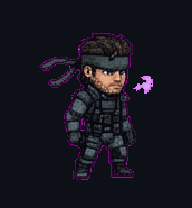 | **Solid Snake (MGS1)** | [`pets/solidsnake`](pets/solidsnake) | FOXHOUND operative in sneaking suit. |
| 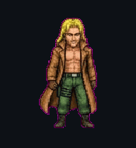 | **Liquid Snake (MGS1)** | [`pets/liquidsnake`](pets/liquidsnake) | FOXHOUND commander and Snake's twin. |
| 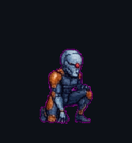 | **Gray Fox / Cyborg Ninja** | [`pets/grayfox`](pets/grayfox) | Cyborg ninja from Shadow Moses. |
| 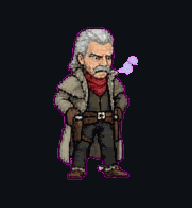 | **Revolver Ocelot** | [`pets/ocelot`](pets/ocelot) | FOXHOUND gunslinger. |
|  | **Dr. Hal 'Otacon' Emmerich** | [`pets/otacon`](pets/otacon) | Shadow Moses engineer and Snake's support. |
| 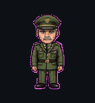 | **Colonel Campbell (MGS1)** | [`pets/campbell`](pets/campbell) | Mission control over codec. |
|  | **Mei Ling** | [`pets/meiling`](pets/meiling) | Data analyst with Soliton Radar. |
| 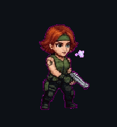 | **Meryl Silverburgh** | [`pets/meryl`](pets/meryl) | Cadet with a Desert Eagle. |
| 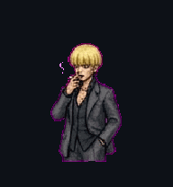 | **Nastasha Romanenko** | [`pets/nastasha`](pets/nastasha) | Nuclear analyst with a dossier. |
| 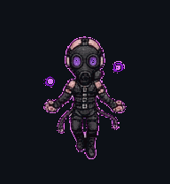 | **Psycho Mantis** | [`pets/psychomantis`](pets/psychomantis) | Psychic member of FOXHOUND. |
| 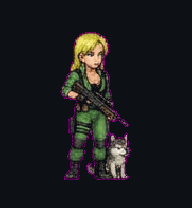 | **Sniper Wolf** | [`pets/sniperwolf`](pets/sniperwolf) | FOXHOUND sniper. |
| 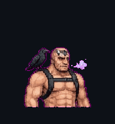 | **Vulcan Raven** | [`pets/vulcanraven`](pets/vulcanraven) | FOXHOUND heavy weapons specialist. |
|  | **Decoy Octopus** | [`pets/decoyoctopus`](pets/decoyoctopus) | FOXHOUND impersonator. |
| 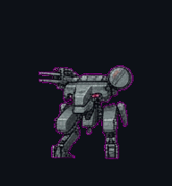 | **Metal Gear REX** | [`pets/metalgearrex`](pets/metalgearrex) | Bipedal nuclear tank from Shadow Moses. |

### Genome Soldiers

| Preview | Pet | Folder | Description |
| --- | --- | --- | --- |
| 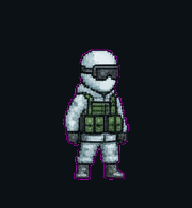 | **Genome Soldier (Arctic Camo)** | [`pets/genomesoldier`](pets/genomesoldier) | Shadow Moses garrison soldier. |
| 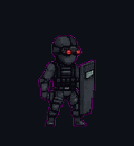 | **Genome Soldier (Black Tactical)** | [`pets/genomesoldier_black`](pets/genomesoldier_black) | Elite guard in charcoal stealth armor. |
| 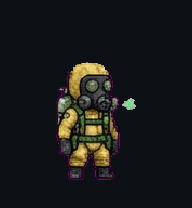 | **Genome Soldier (Hazmat Gas Mask)** | [`pets/genomesoldier_hazmat`](pets/genomesoldier_hazmat) | Chemical warfare sentry in an NBC suit. |
| 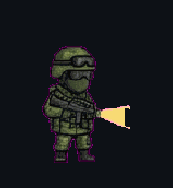 | **Genome Soldier (Woodland)** | [`pets/genomesoldier_woodland`](pets/genomesoldier_woodland) | Interior sentry in olive woodland camo. |

### MGS2 bonus

| Preview | Pet | Folder | Description |
| --- | --- | --- | --- |
| 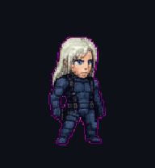 | **Raiden (MGS2)** | [`pets/raiden`](pets/raiden) | Foxhound recruit from *Sons of Liberty*. |
| 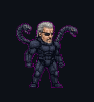 | **Solidus Snake** | [`pets/solidussnake`](pets/solidussnake) | Exoskeleton, snake arms, dual HF swords. |
| 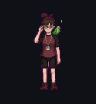 | **Emma Emmerich** | [`pets/emma`](pets/emma) | E.E. with parrot and GW optical disc. |
| 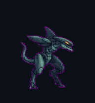 | **Metal Gear RAY** | [`pets/metalgearray`](pets/metalgearray) | Amphibious bipedal mecha. |

A file-level listing lives in [INVENTORY.md](INVENTORY.md).

## Installation

Pets install into:

```text
~/.codex/pets/<pet-id>/
```

Each pet folder already uses that layout:

```text
pets/solidsnake/
├── pet.json
├── spritesheet.png
└── spritesheet.webp
```

Full steps, including one-pet install, full-pack install, updates, and uninstall, are in [docs/INSTALLATION.md](docs/INSTALLATION.md).

### Install one pet

```bash
git clone https://github.com/VinceGuyMan/MGS-Pet-Pack.git
cp -R MGS-Pet-Pack/pets/solidsnake ~/.codex/pets/
```

### Install the full pack

```bash
git clone https://github.com/VinceGuyMan/MGS-Pet-Pack.git
mkdir -p ~/.codex/pets
cp -R MGS-Pet-Pack/pets/*/ ~/.codex/pets/
```

Restart Codex after copying so it picks up the new pets. In Codex, choose a custom pet from the installed folder names.

## Compatibility

These pets are packaged for Codex custom pets:

- Manifests use `spriteVersionNumber: 2`
- Spritesheets are `1536x2288` (8×11 cells of `192×208`)
- Each pet provides `pet.json` plus `spritesheet.webp` (and a PNG copy)
- Install location is `~/.codex/pets/<pet-id>/`

This pack does not claim compatibility with other pet hosts unless those hosts read the same Codex v2 folder layout.

## Download

- Repository: [github.com/VinceGuyMan/MGS-Pet-Pack](https://github.com/VinceGuyMan/MGS-Pet-Pack)
- Source ZIP: [Download the latest source](https://github.com/VinceGuyMan/MGS-Pet-Pack/archive/refs/heads/vinceguyman-publish-pet-pack.zip)
- Releases: [github.com/VinceGuyMan/MGS-Pet-Pack/releases](https://github.com/VinceGuyMan/MGS-Pet-Pack/releases)

## Fan-project disclaimer

This is an unofficial, non-commercial fan-made pet pack. Metal Gear Solid and related characters, names, trademarks, and intellectual property belong to their respective rights holders. This repository is not affiliated with or endorsed by Konami.

This disclaimer is attribution, not legal advice. It does not claim that these assets are public domain, officially licensed, or that non-commercial use grants redistribution rights.

See [NOTICE.md](NOTICE.md).

## Credits

- Pet pack assembled and published by [VinceGuyMan](https://github.com/VinceGuyMan)
- Pets follow the Codex v2 custom-pet layout (`pet.json` + spritesheet)
- *Metal Gear Solid*, related characters, Metal Gear REX, and Metal Gear RAY belong to their respective rights holders

## License

Original repository documentation is offered under the MIT License in [LICENSE](LICENSE).

That MIT license covers original documentation in this repository. It does **not** grant rights over Metal Gear Solid, Konami characters, trademarks, names, or associated intellectual property.

Fan-made pet sprites and manifests in `pets/` are original files created for this unofficial fan project. They depict or reference third-party characters and IP. See [NOTICE.md](NOTICE.md) and [LICENSE](LICENSE).
